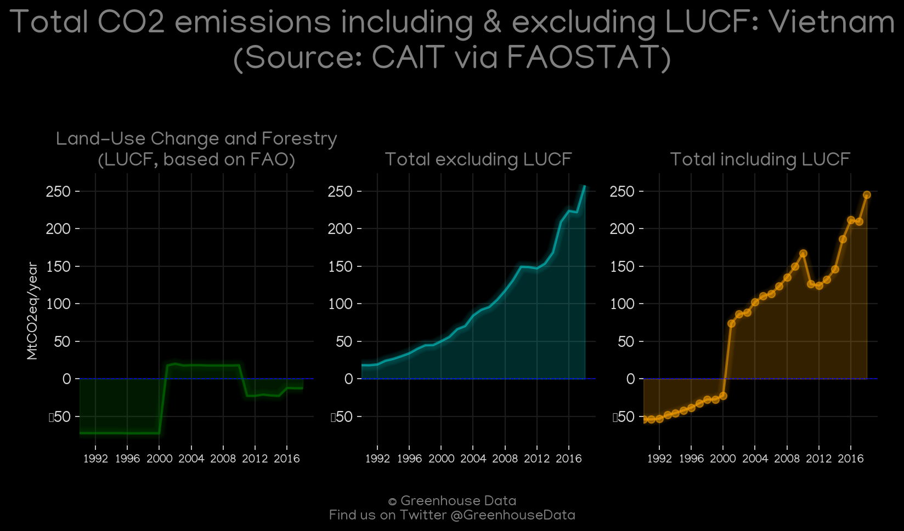
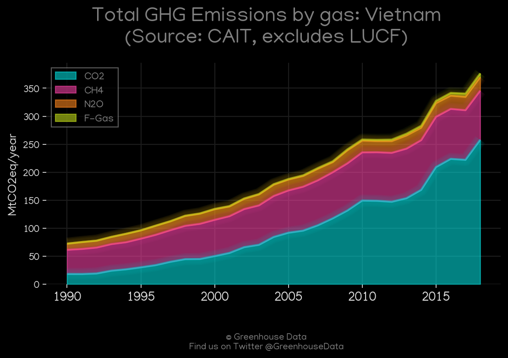
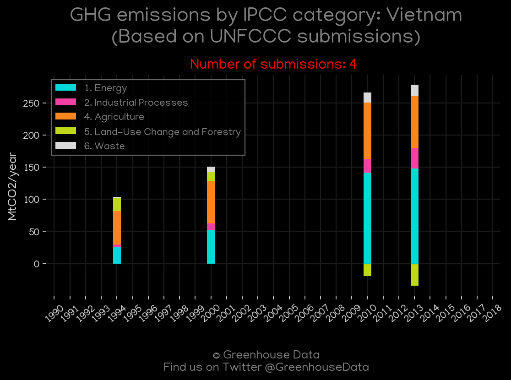
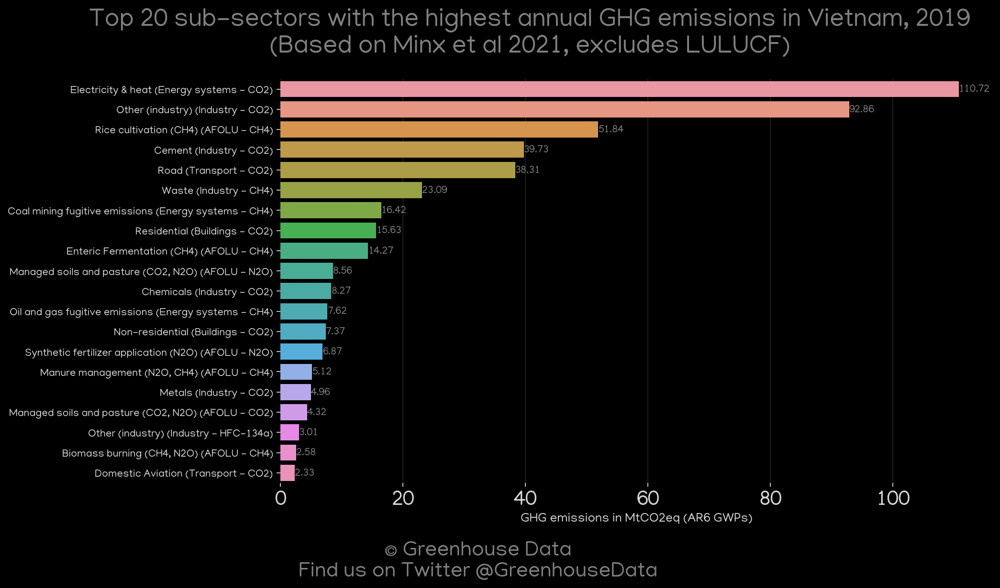
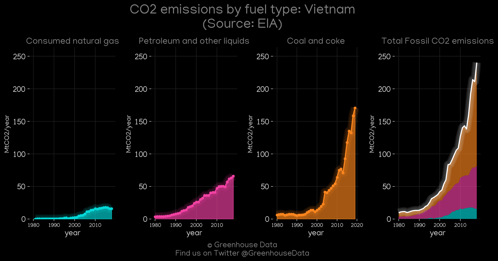
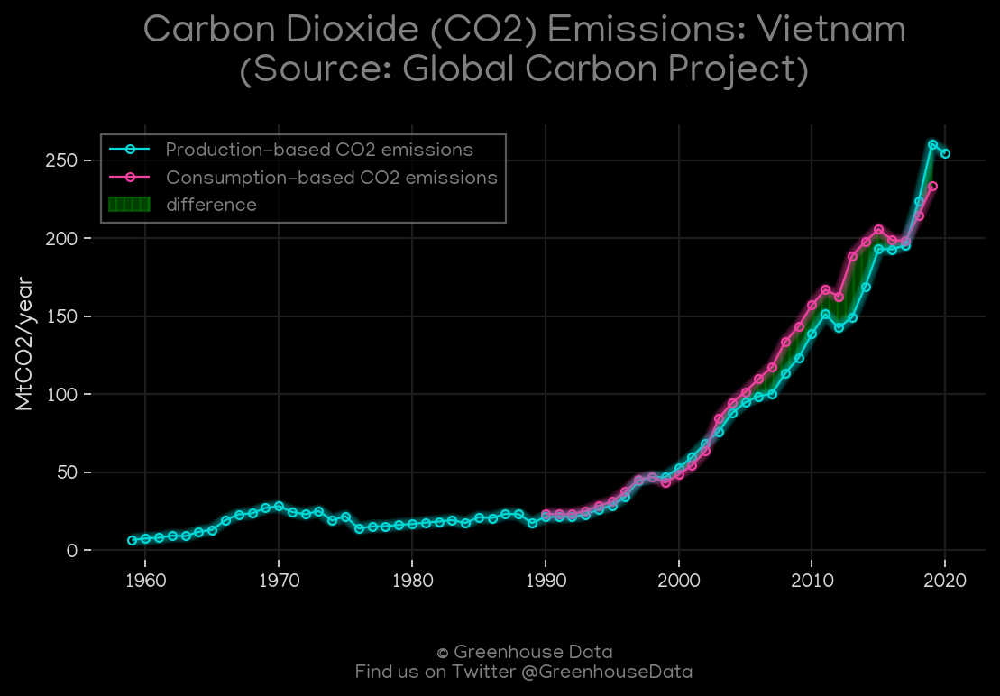
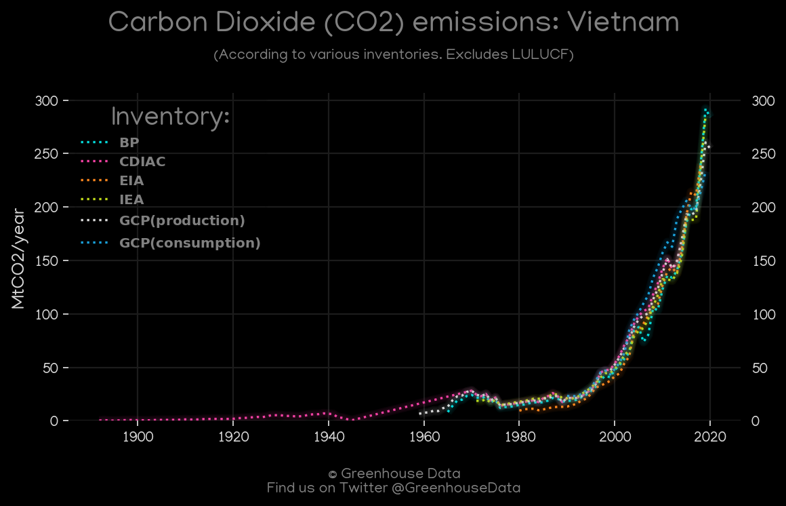
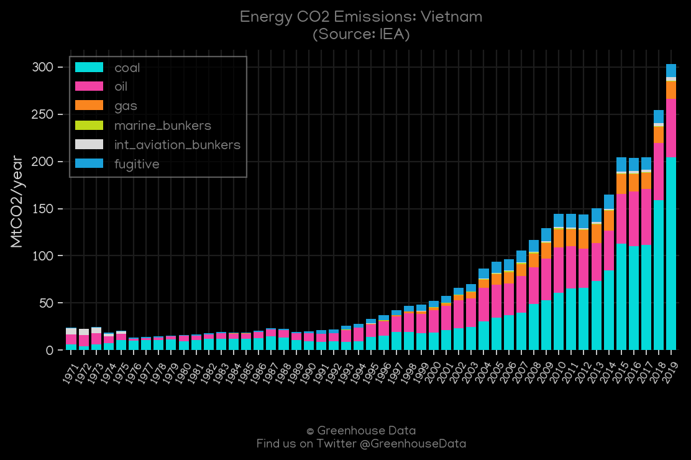
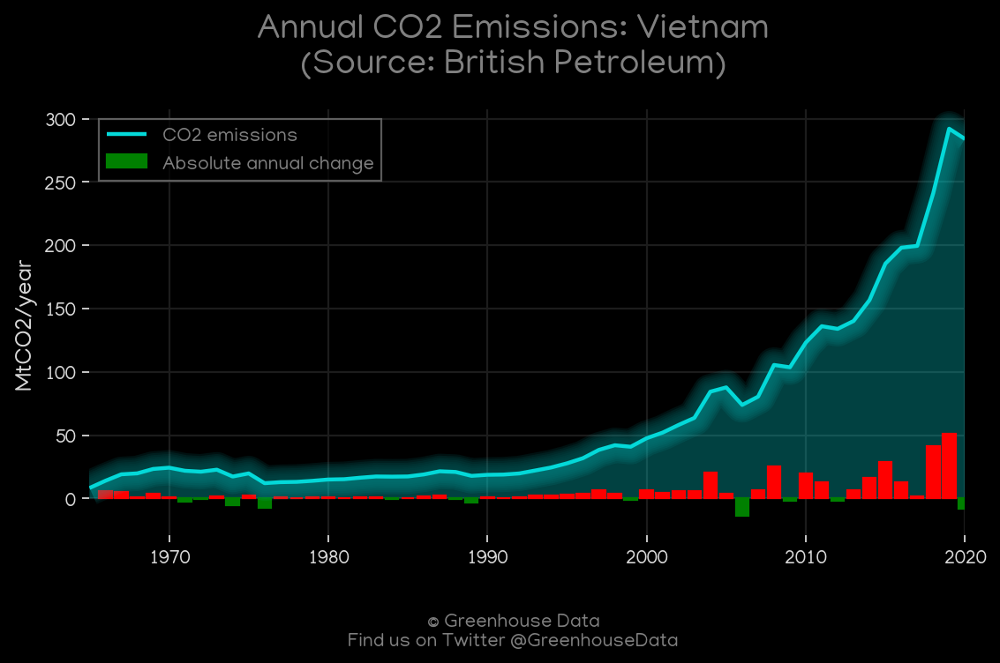
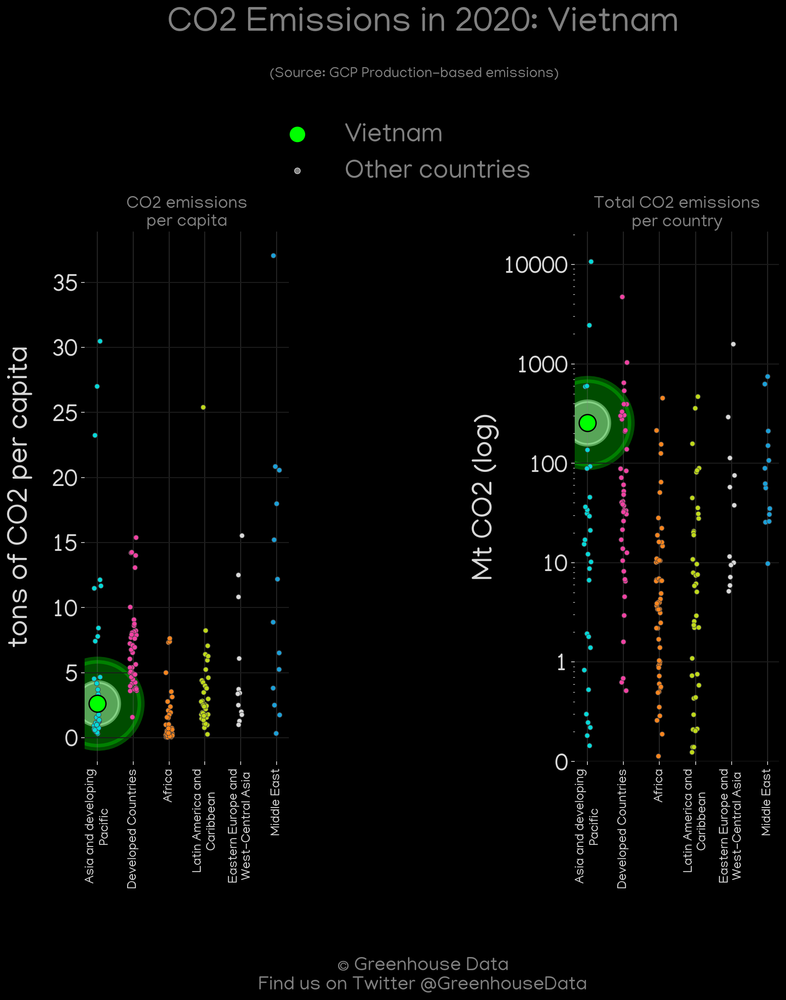

<h1 align="center">
🇻🇳🇻🇳🇻🇳🇻🇳🇻🇳
 
Vietnam
 
🇻🇳🇻🇳🇻🇳🇻🇳🇻🇳
</h1>
<h2>Datasets:</h2>

<a href="https://github.com/dquintani/GreenhouseData/tree/master/country_data/VNM_Vietnam/data">View on Github</a>
 

<a href="data/VNM_GCP_consupmption.csv">GCP_consupmption</a> || <a href="data/VNM_IEA.csv">IEA</a> || <a href="data/VNM_EDGAR.csv">EDGAR</a> || <a href="data/VNM_EIA.csv">EIA</a> || <a href="data/VNM_EPA.csv">EPA</a> || <a href="data/VNM_Minx_2021.csv">Minx_2021</a> || <a href="data/VNM_BP.csv">BP</a> || <a href="data/VNM_CAIT.csv">CAIT</a> || <a href="data/VNM_CDIAC.csv">CDIAC</a> || <a href="data/VNM_FAO.csv">FAO</a> || <a href="data/VNM_GCP.csv">GCP</a> || <a href="data/VNM_PRIMAP-hist.csv">PRIMAP-hist</a>

 

<h1>Figures:</h1><h2>#1 (VNM_CAIT_lucf_vs_nolucf)</h2>

<h2>#2 (VNM_CAIT_gases_1)</h2>

<h2>#3 (VNM_CDIAC_1)</h2>

<h2>#4 (VNM_UNFCCC_NAI_1)</h2>

<h2>#5 (VNM_Minx_top20_subsectors)</h2>

<h2>#6 (VNM_EIA_1)</h2>

<h2>#7 (VNM_GCP_1)</h2>

<h2>#8 (VNM_CO2_totals)</h2>

<h2>#9 (VNM_IEA_1)</h2>

<h2>#10 (VNM_BP_1)</h2>

<h2>#11 (VNM_GCP_Country_Highlight)</h2>

