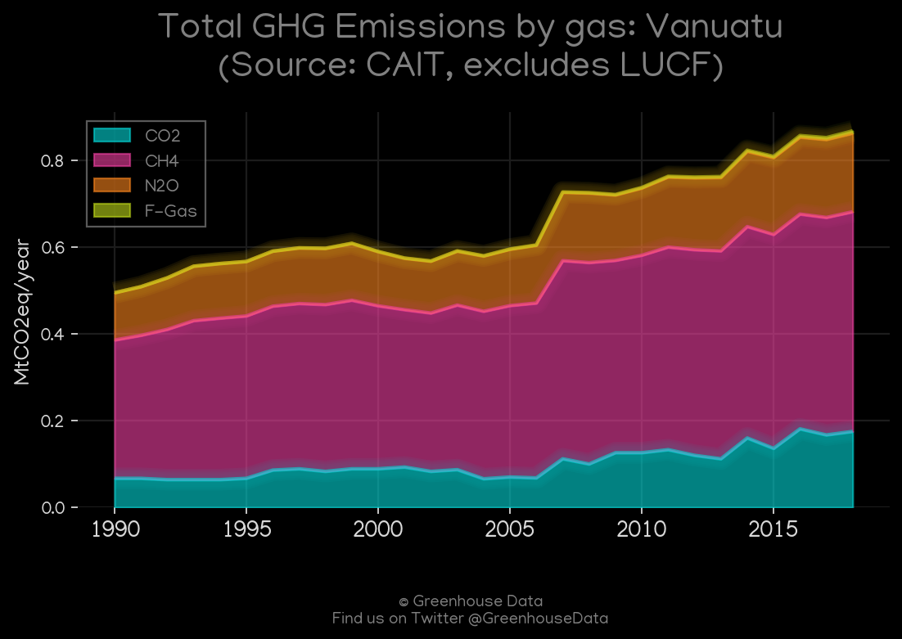
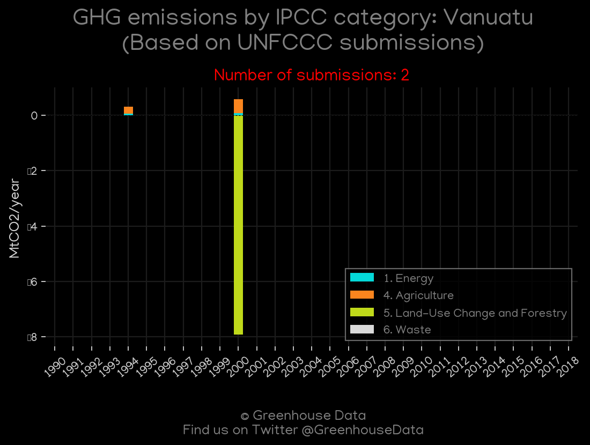
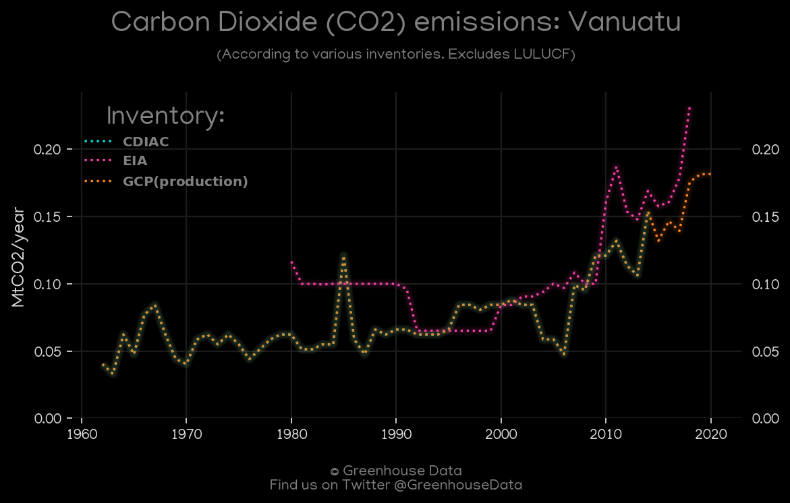
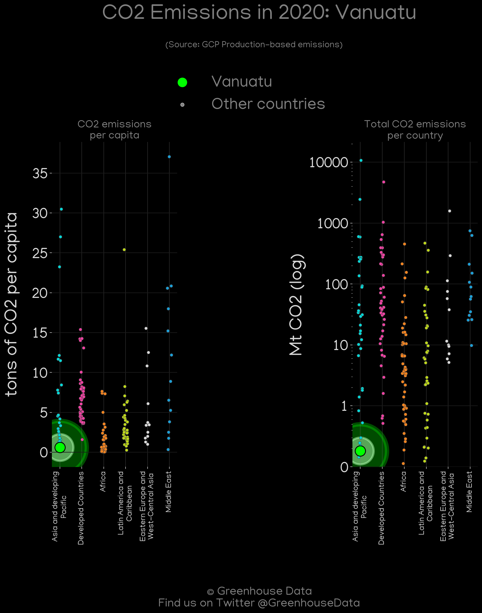
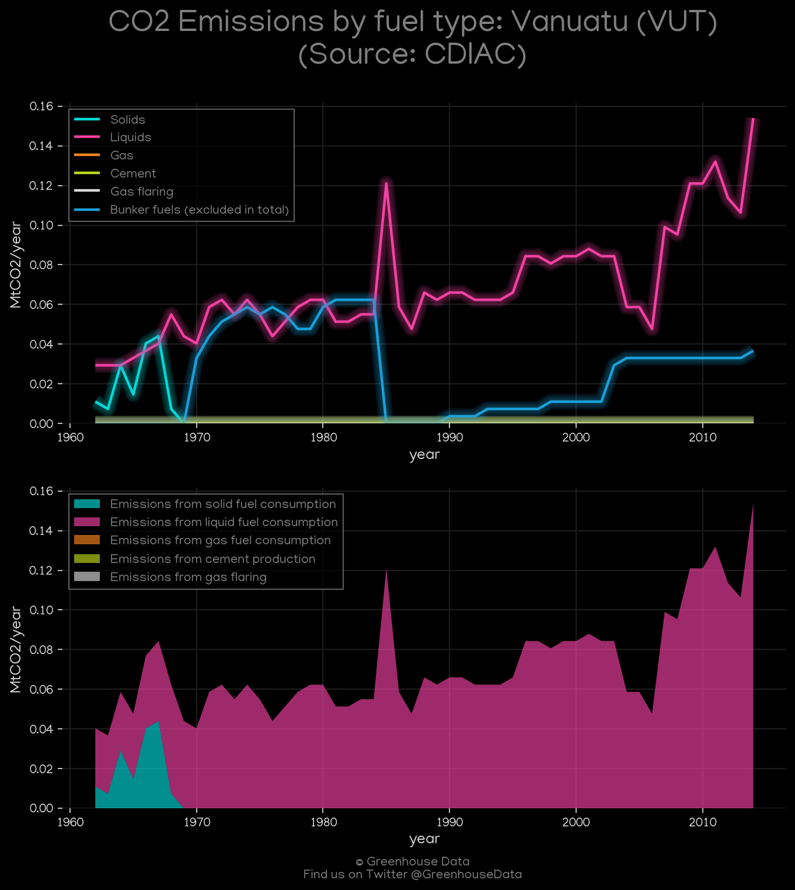
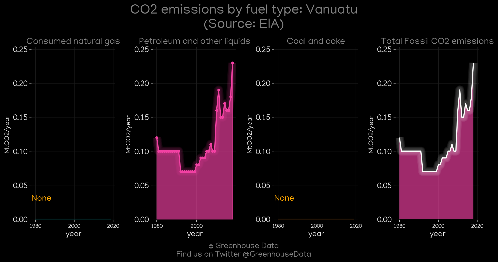
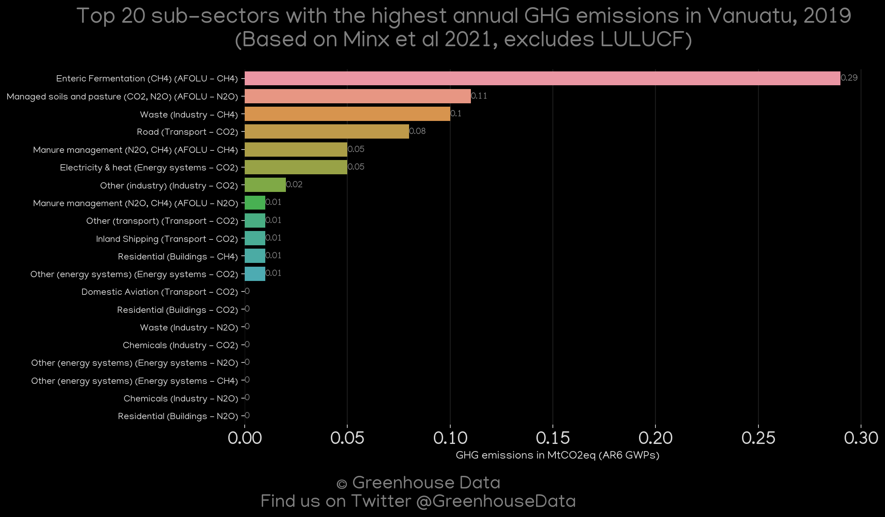

<h1 align="center">
🇻🇺🇻🇺🇻🇺🇻🇺🇻🇺
 
Vanuatu
 
🇻🇺🇻🇺🇻🇺🇻🇺🇻🇺
</h1>
<h2>Datasets:</h2>

<a href="https://github.com/dquintani/GreenhouseData/tree/master/country_data/VUT_Vanuatu/data">View on Github</a>
 

<a href="data/VUT_CDIAC.csv">CDIAC</a> || <a href="data/VUT_EPA.csv">EPA</a> || <a href="data/VUT_PRIMAP-hist.csv">PRIMAP-hist</a> || <a href="data/VUT_CAIT.csv">CAIT</a> || <a href="data/VUT_Minx_2021.csv">Minx_2021</a> || <a href="data/VUT_FAO.csv">FAO</a> || <a href="data/VUT_EIA.csv">EIA</a> || <a href="data/VUT_GCP_consupmption.csv">GCP_consupmption</a> || <a href="data/VUT_GCP.csv">GCP</a> || <a href="data/VUT_EDGAR.csv">EDGAR</a>

 

<h1>Figures:</h1><h2>#1 (VUT_CAIT_gases_1)</h2>

<h2>#2 (VUT_UNFCCC_NAI_1)</h2>

<h2>#3 (VUT_CO2_totals)</h2>

<h2>#4 (VUT_GCP_Country_Highlight)</h2>

<h2>#5 (VUT_CDIAC_1)</h2>

<h2>#6 (VUT_EIA_1)</h2>

<h2>#7 (VUT_GCP_1)</h2>

<h2>#8 (VUT_Minx_top20_subsectors)</h2>

