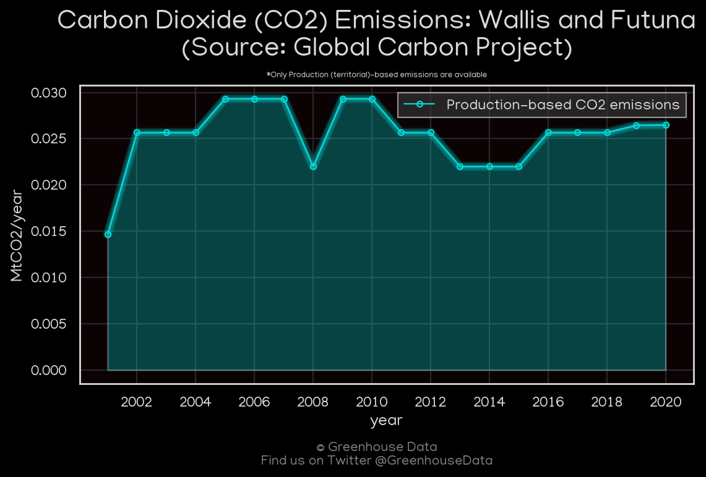
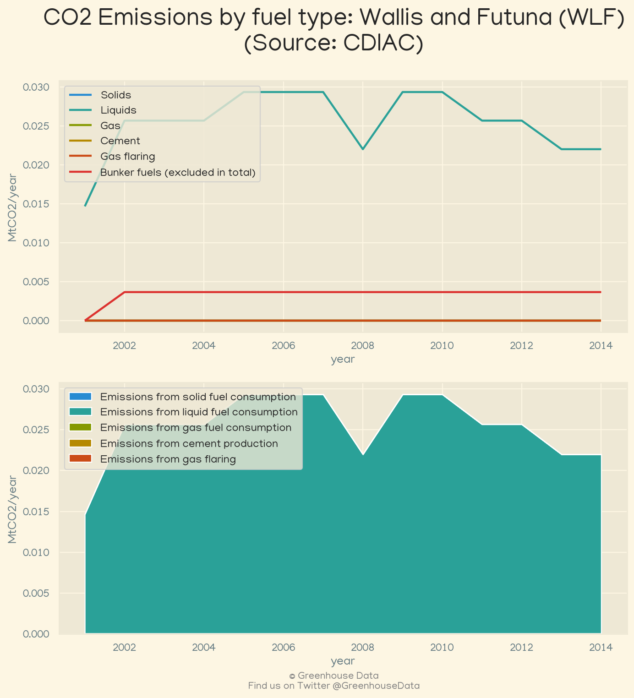
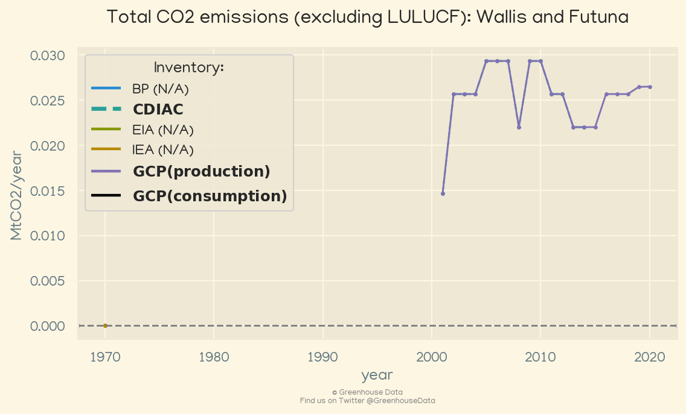
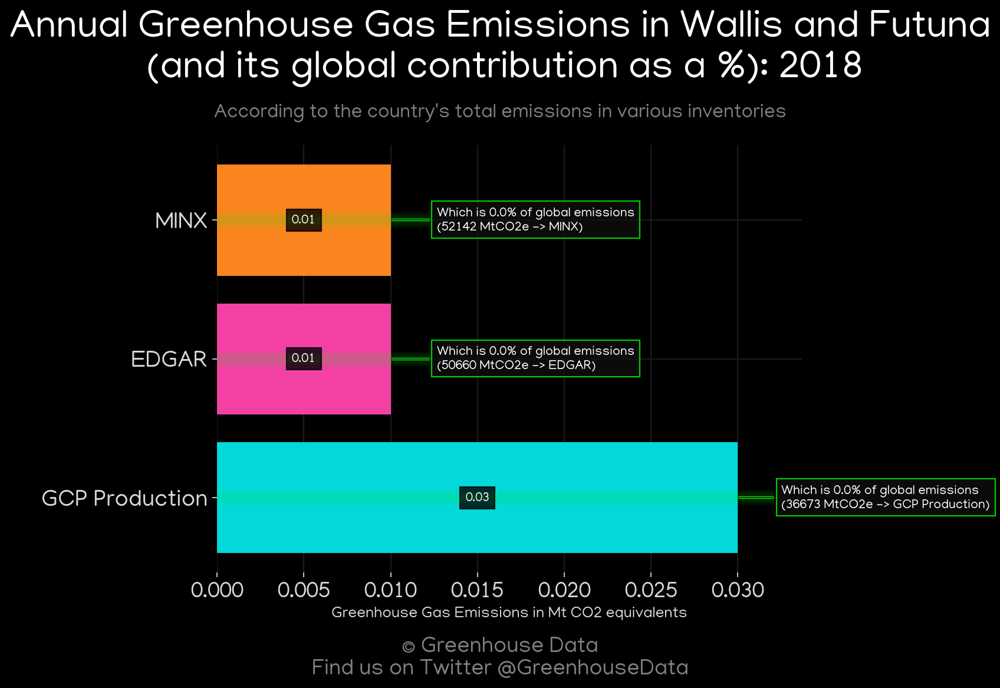
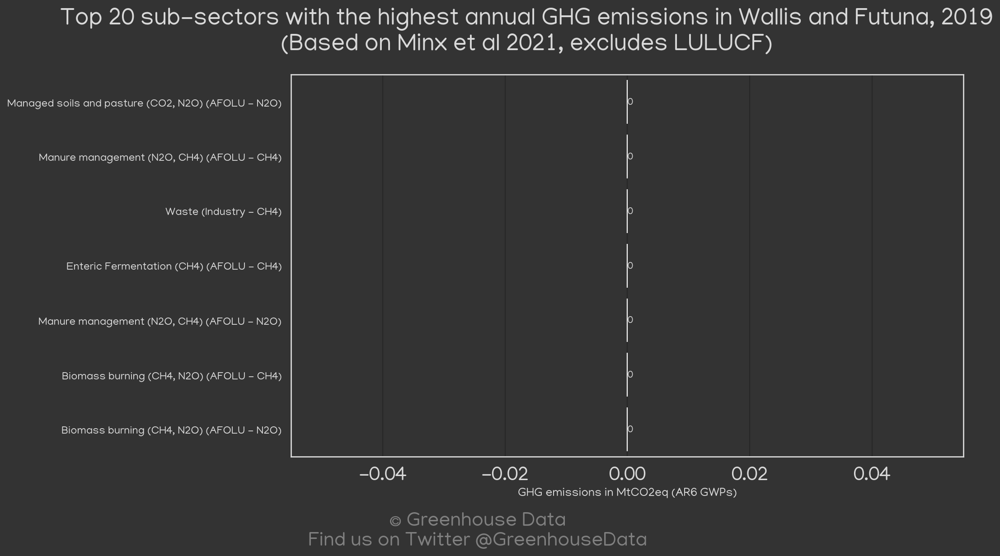

<h1 align="center">
🇼🇫🇼🇫🇼🇫🇼🇫🇼🇫
 
Wallis and Futuna
 
🇼🇫🇼🇫🇼🇫🇼🇫🇼🇫
</h1>
<h2>Datasets:</h2>

<a href="https://github.com/dquintani/GreenhouseData/tree/master/country_data/WLF_Wallis and Futuna/data">View on Github</a>
 

<a href="data/WLF_EDGAR.csv">EDGAR</a> || <a href="data/WLF_Minx_2021.csv">Minx_2021</a> || <a href="data/WLF_GCP.csv">GCP</a> || <a href="data/WLF_CDIAC.csv">CDIAC</a> || <a href="data/WLF_GCP_consupmption.csv">GCP_consupmption</a> || <a href="data/WLF_FAO.csv">FAO</a>

 

<h1>Figures:</h1><h2>#1 (WLF_GCP_1)</h2>

<h2>#2 (WLF_CDIAC_1)</h2>

<h2>#3 (WLF_CO2_totals)</h2>

<h2>#4 (WLF_relative_totals)</h2>

<h2>#5 (WLF_Minx_top20_subsectors)</h2>

