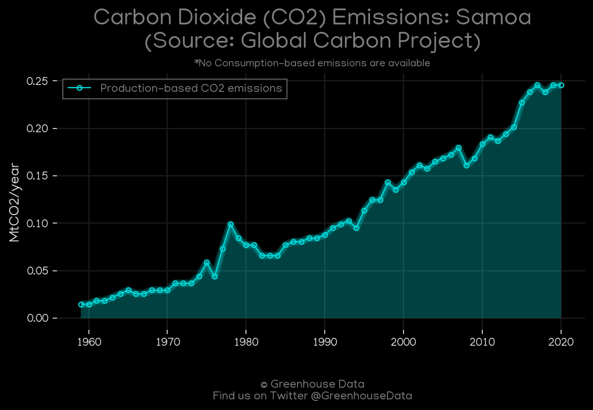
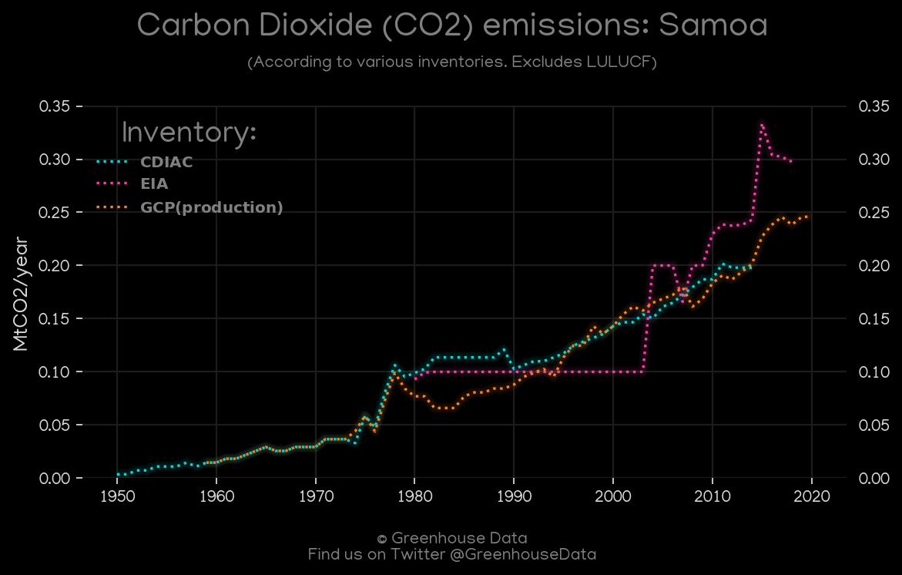
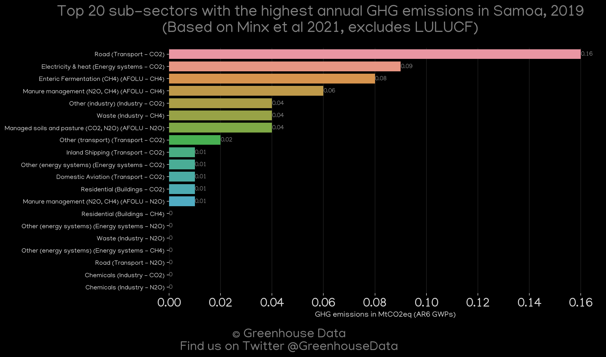
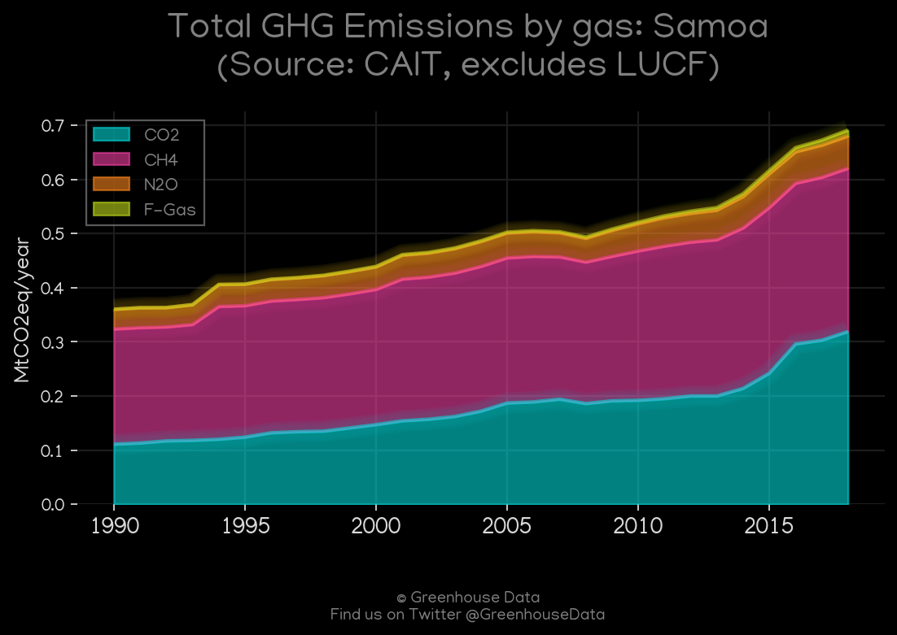
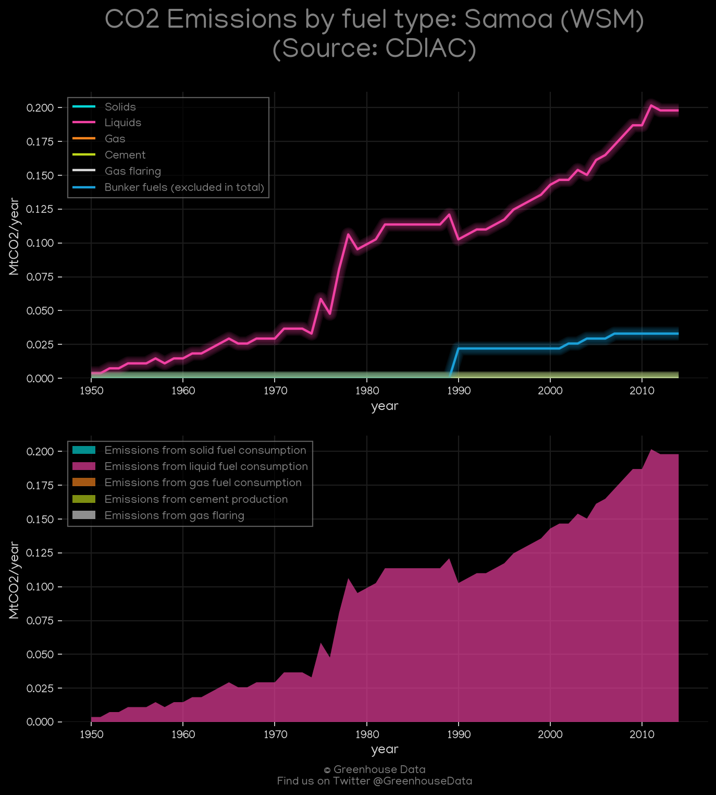
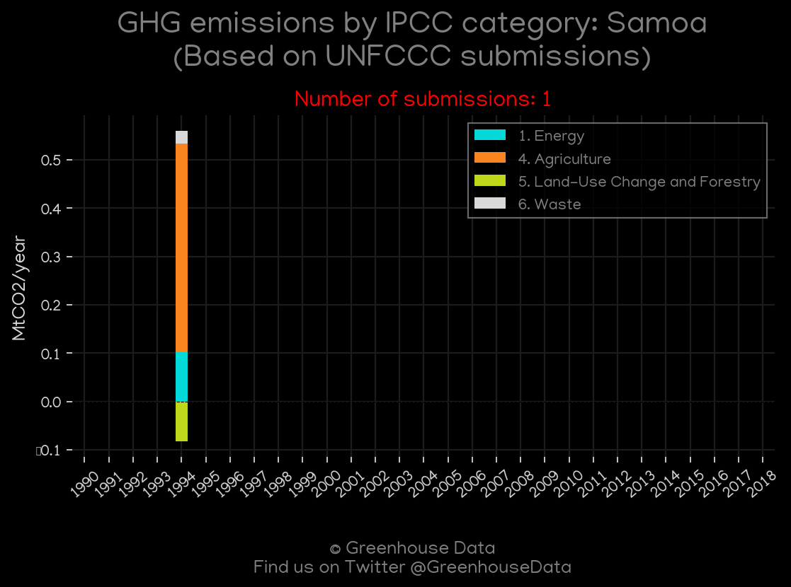

<h1 align="center">
🇼🇸🇼🇸🇼🇸🇼🇸🇼🇸
 
Samoa
 
🇼🇸🇼🇸🇼🇸🇼🇸🇼🇸
</h1>
<h2>Datasets:</h2>

<a href="https://github.com/dquintani/GreenhouseData/tree/master/country_data/WSM_Samoa/data">View on Github</a>
 

<a href="data/WSM_GCP_consupmption.csv">GCP_consupmption</a> || <a href="data/WSM_FAO.csv">FAO</a> || <a href="data/WSM_EPA.csv">EPA</a> || <a href="data/WSM_EDGAR.csv">EDGAR</a> || <a href="data/WSM_CDIAC.csv">CDIAC</a> || <a href="data/WSM_PRIMAP-hist.csv">PRIMAP-hist</a> || <a href="data/WSM_GCP_cons.csv">GCP_cons</a> || <a href="data/WSM_Minx_2021.csv">Minx_2021</a> || <a href="data/WSM_GCP.csv">GCP</a> || <a href="data/WSM_EIA.csv">EIA</a> || <a href="data/WSM_CAIT.csv">CAIT</a>

 

<h1>Figures:</h1><h2>#1 (WSM_GCP_1)</h2>

<h2>#2 (WSM_CO2_totals)</h2>

<h2>#3 (WSM_EIA_1)</h2>

<h2>#4 (WSM_Minx_top20_subsectors)</h2>

<h2>#5 (WSM_CAIT_gases_1)</h2>

<h2>#6 (WSM_CDIAC_1)</h2>

<h2>#7 (WSM_UNFCCC_NAI_1)</h2>

<h2>#8 (WSM_BP_1)</h2>

