

<h1 align="center">
🇿🇦🇿🇦🇿🇦🇿🇦🇿🇦
 
South Africa
 
🇿🇦🇿🇦🇿🇦🇿🇦🇿🇦
</h1>
<h2>Datasets:</h2>

<a href="https://github.com/dquintani/GreenhouseData/tree/master/country_data/ZAF_South Africa/data">View on Github</a>
 

<a href="data/ZAF_GCP.csv">GCP</a> || <a href="data/ZAF_CDIAC.csv">CDIAC</a> || <a href="data/ZAF_EIA.csv">EIA</a> || <a href="data/ZAF_IEA.csv">IEA</a> || <a href="data/ZAF_FAO.csv">FAO</a> || <a href="data/ZAF_CAIT.csv">CAIT</a> || <a href="data/ZAF_GCP_consupmption.csv">GCP_consupmption</a> || <a href="data/ZAF_EPA.csv">EPA</a> || <a href="data/ZAF_PRIMAP-hist.csv">PRIMAP-hist</a> || <a href="data/ZAF_EDGAR.csv">EDGAR</a> || <a href="data/ZAF_Minx_2021.csv">Minx_2021</a> || <a href="data/ZAF_BP.csv">BP</a>

 

<h1>Figures:</h1><h2>#1 (ZAF_CAIT_lucf_vs_nolucf)</h2>

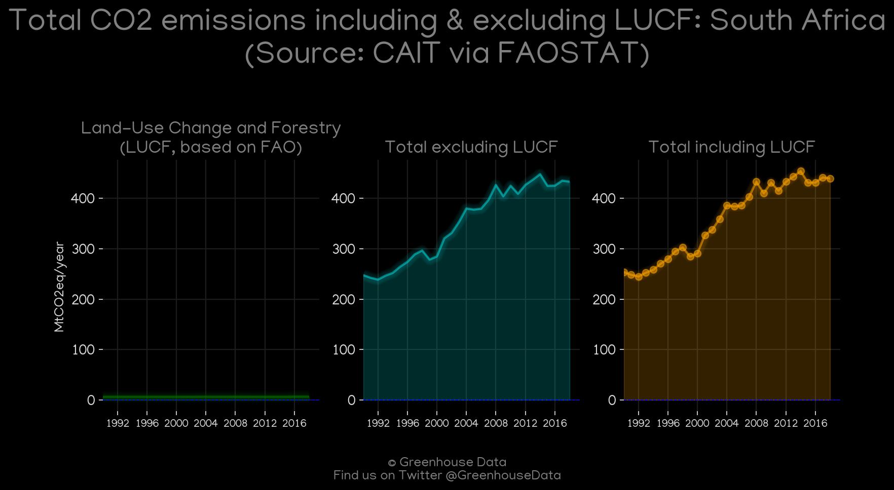
<h2>#2 (ZAF_IEA_1)</h2>

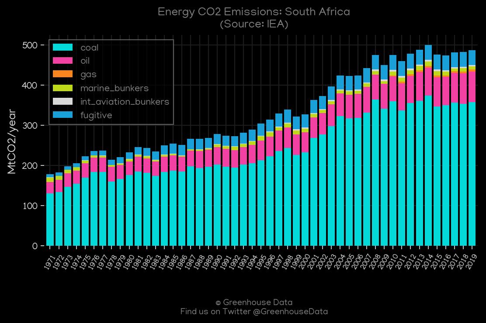
<h2>#3 (ZAF_CAIT_gases_1)</h2>

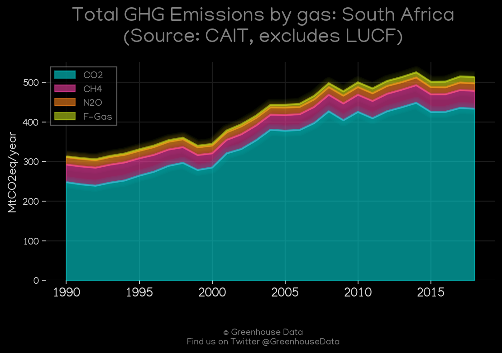
<h2>#4 (ZAF_CDIAC_1)</h2>

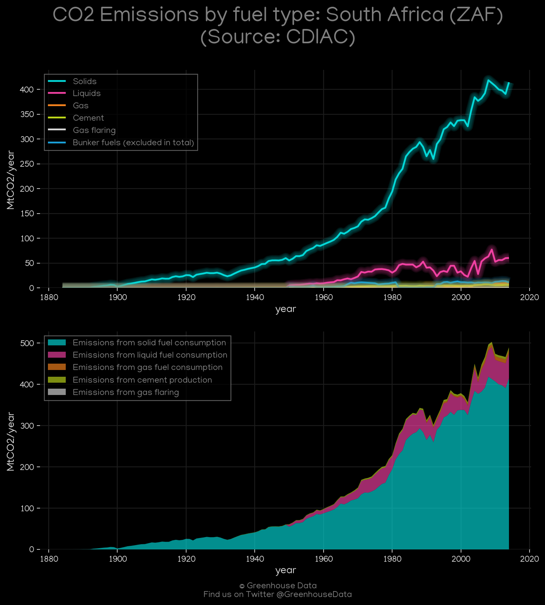
<h2>#5 (ZAF_Minx_top20_subsectors)</h2>

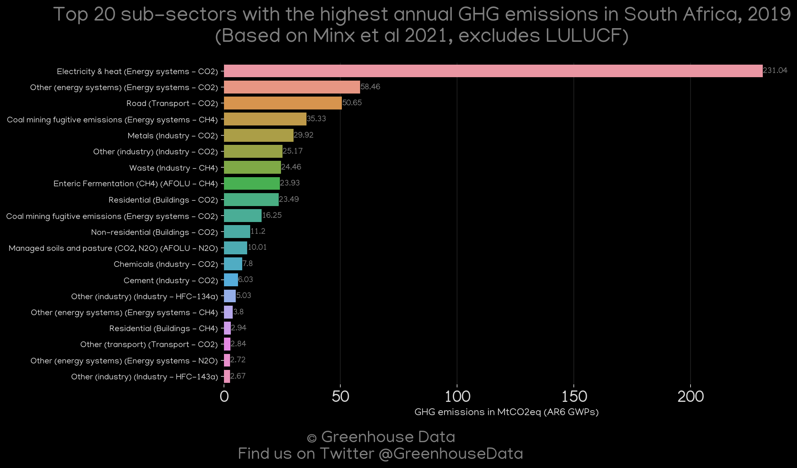
<h2>#6 (ZAF_GCP_1)</h2>

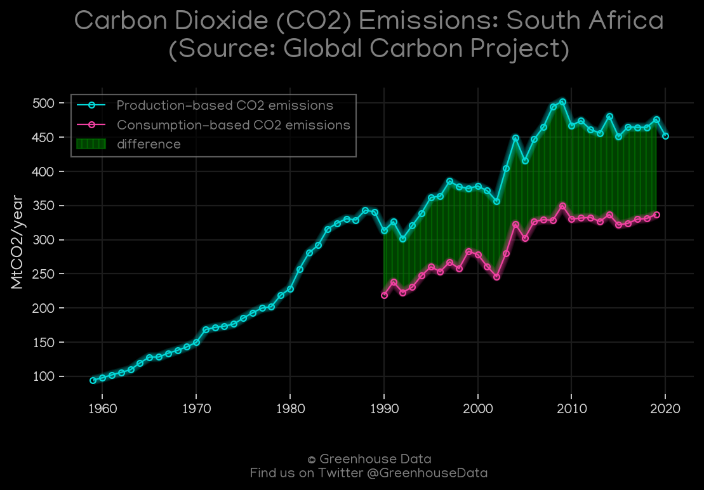
<h2>#7 (ZAF_relative_totals)</h2>

<h2>#8 (ZAF_EIA_1)</h2>

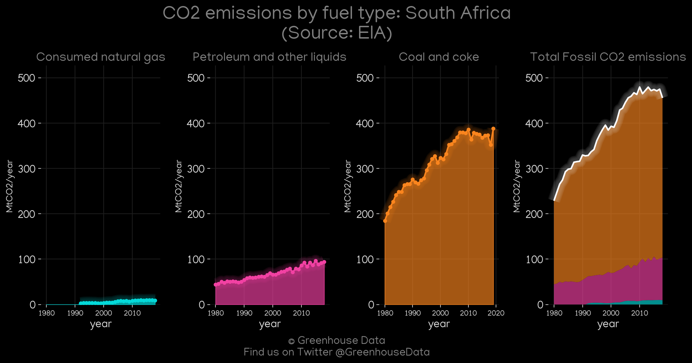
<h2>#9 (ZAF_BP_1)</h2>

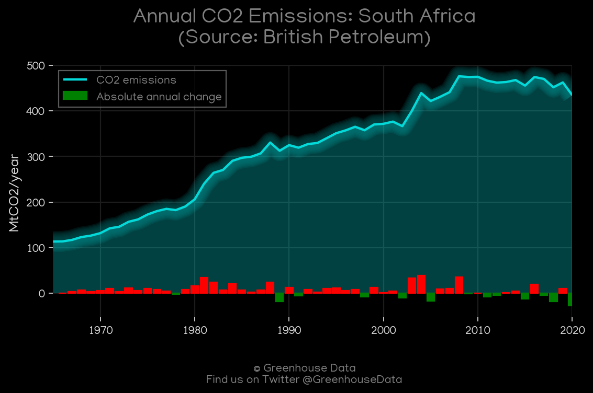
<h2>#10 (ZAF_GCP_Country_Highlight)</h2>

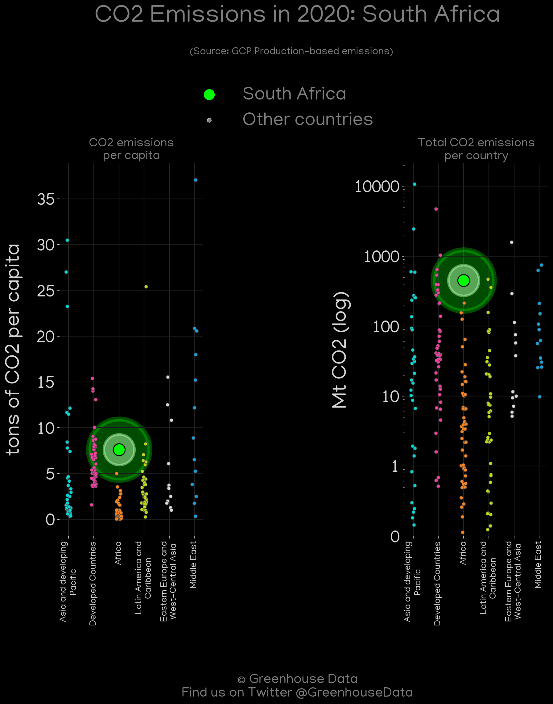
<h2>#11 (ZAF_UNFCCC_NAI_1)</h2>

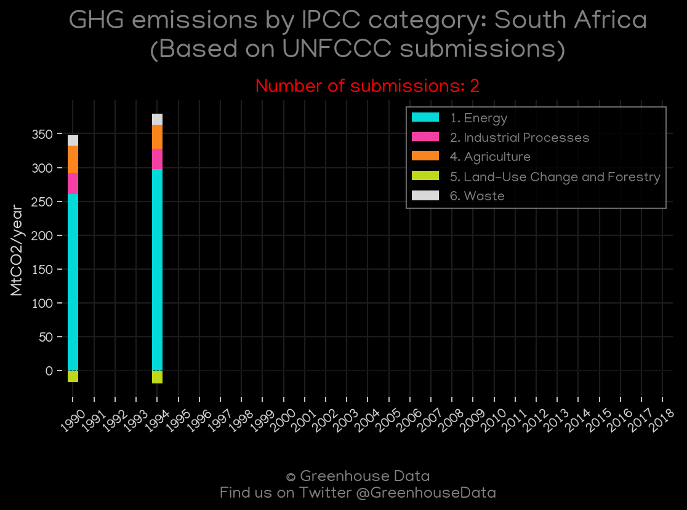
<h2>#12 (ZAF_CO2_totals)</h2>

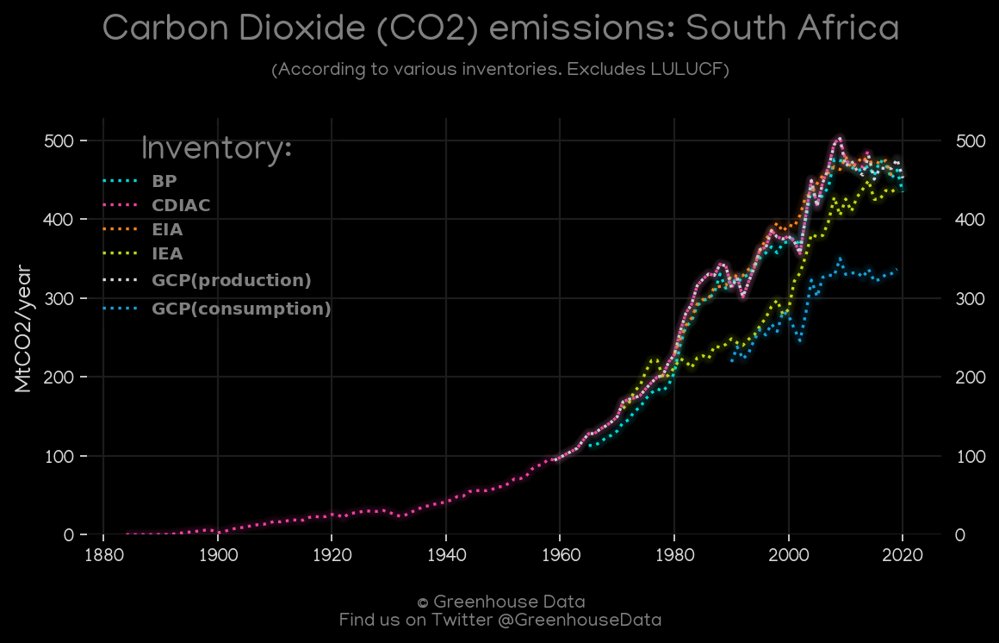
