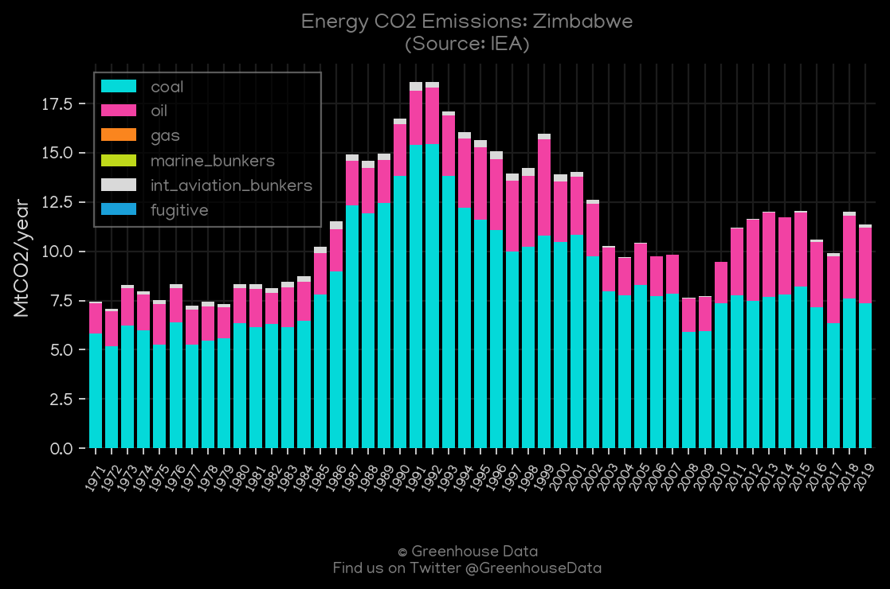
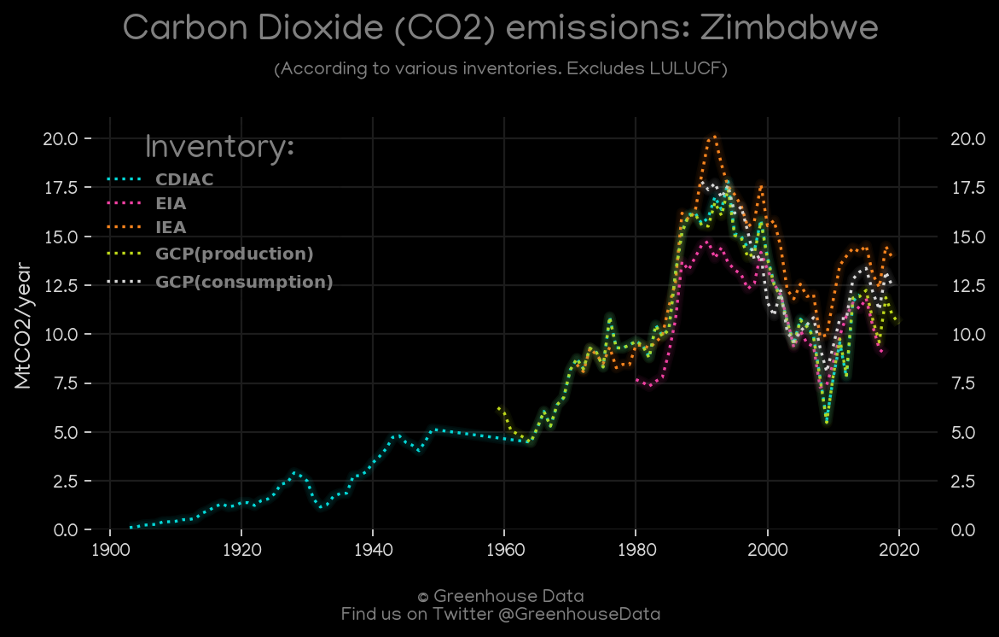
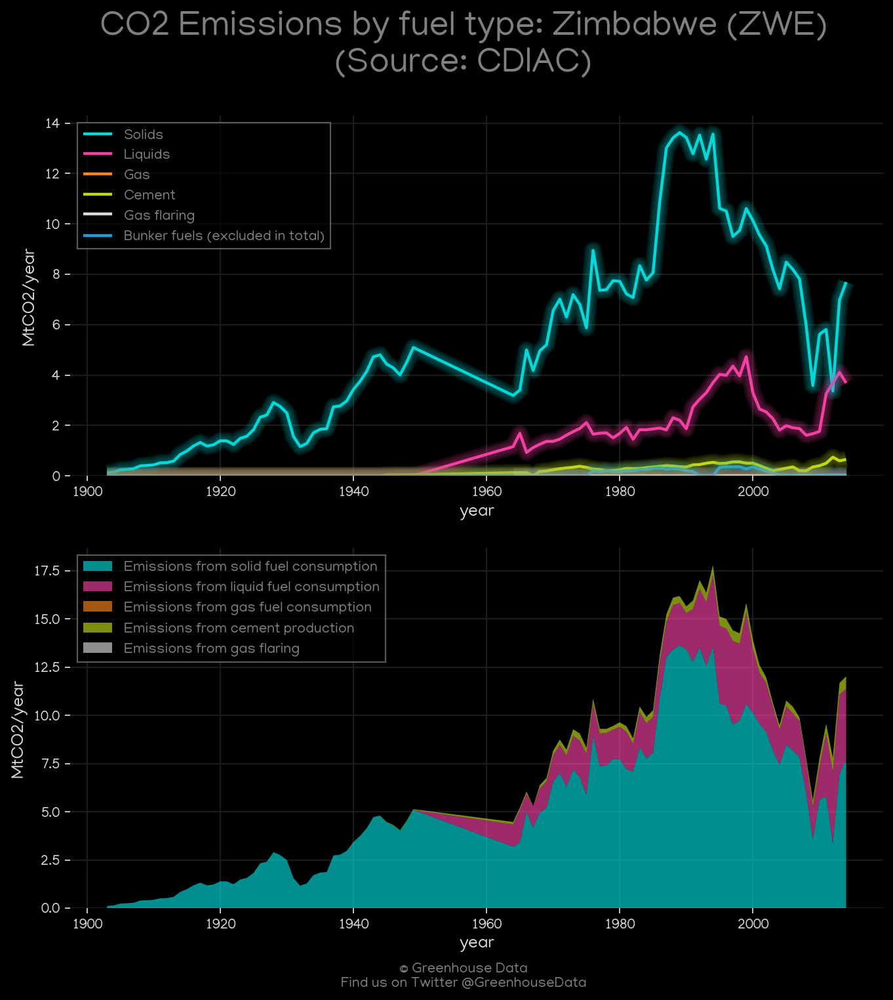
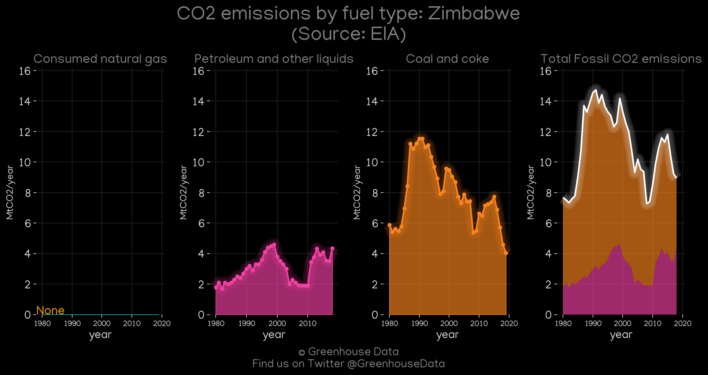
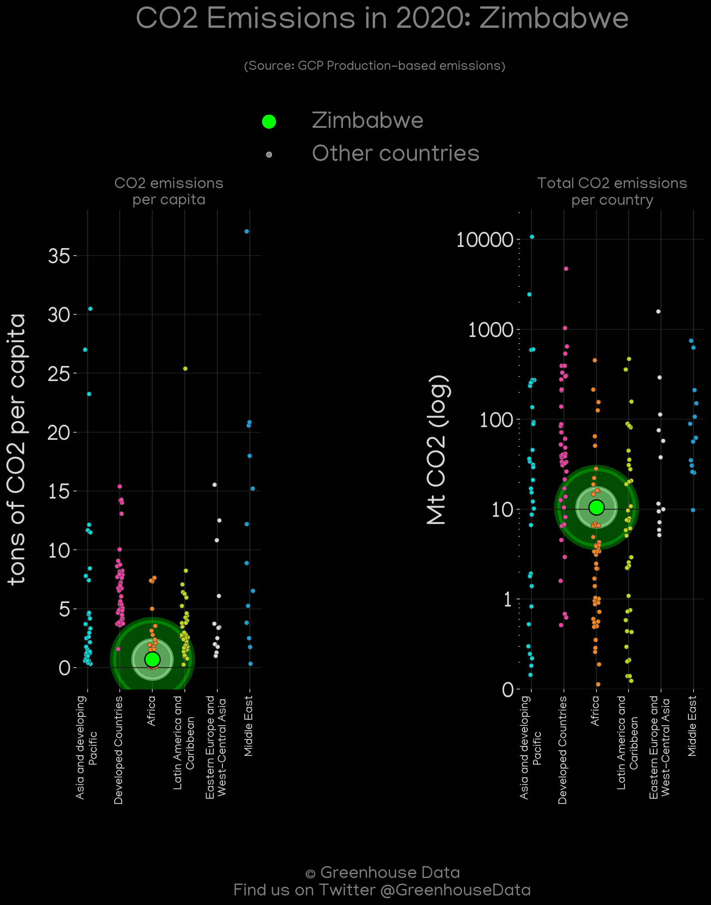
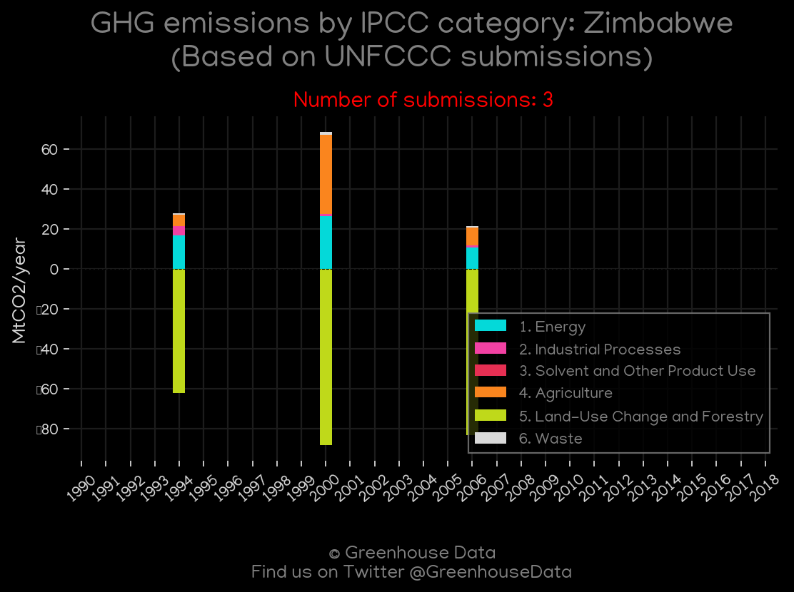
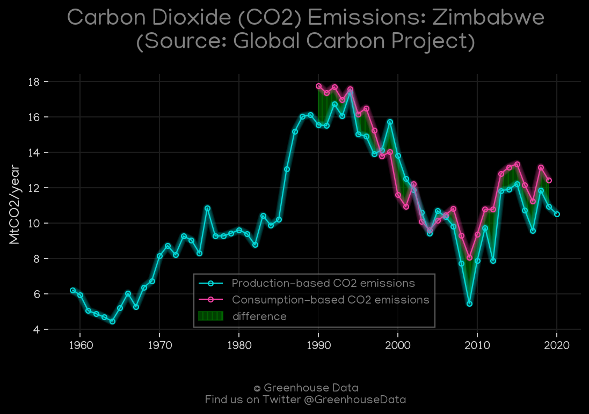
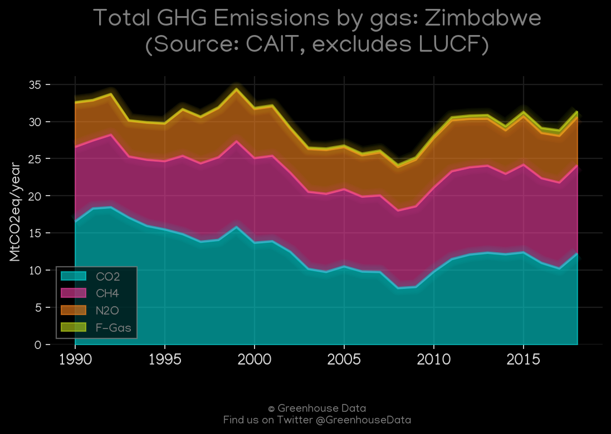
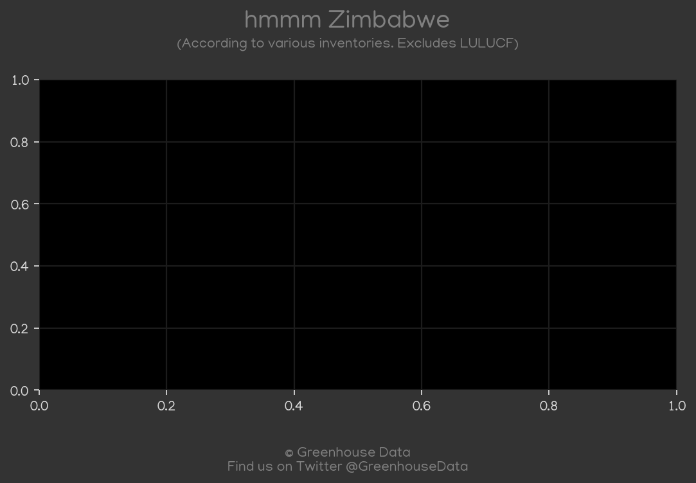
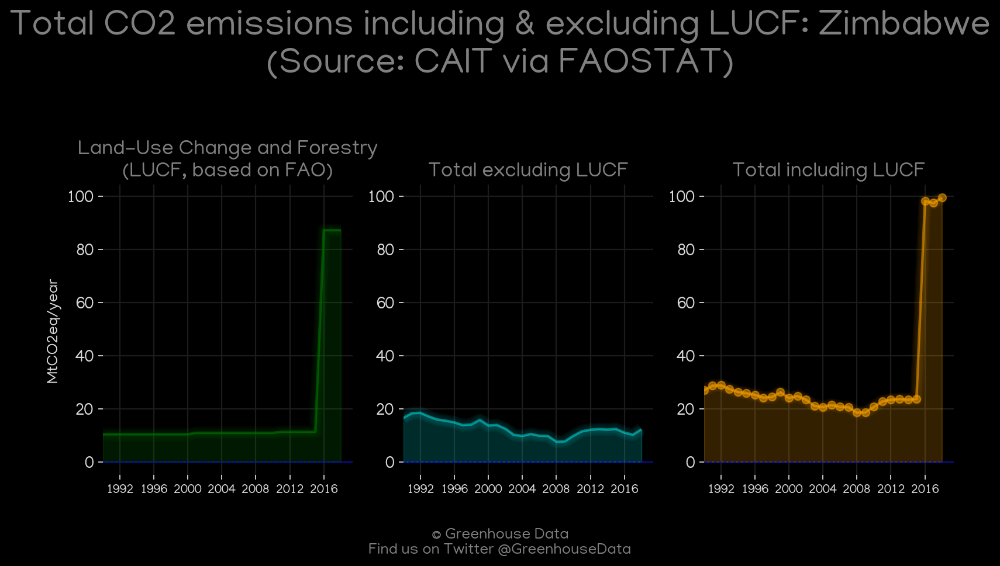

<h1 align="center">
🇿🇼🇿🇼🇿🇼🇿🇼🇿🇼
 
Zimbabwe
 
🇿🇼🇿🇼🇿🇼🇿🇼🇿🇼
</h1>
<h2>Datasets:</h2>

<a href="https://github.com/dquintani/GreenhouseData/tree/master/country_data/ZWE_Zimbabwe/data">View on Github</a>
 

<a href="data/ZWE_GCP.csv">GCP</a> || <a href="data/ZWE_CAIT.csv">CAIT</a> || <a href="data/ZWE_EDGAR.csv">EDGAR</a> || <a href="data/ZWE_IEA.csv">IEA</a> || <a href="data/ZWE_CDIAC.csv">CDIAC</a> || <a href="data/ZWE_EPA.csv">EPA</a> || <a href="data/ZWE_FAO.csv">FAO</a> || <a href="data/ZWE_Minx_2021.csv">Minx_2021</a> || <a href="data/ZWE_EIA.csv">EIA</a> || <a href="data/ZWE_GCP_consupmption.csv">GCP_consupmption</a> || <a href="data/ZWE_PRIMAP-hist.csv">PRIMAP-hist</a>

 

<h1>Figures:</h1><h2>#1 (ZWE_IEA_1)</h2>

<h2>#2 (ZWE_CO2_totals)</h2>

<h2>#3 (ZWE_Minx_top20_subsectors)</h2>

<h2>#4 (ZWE_CDIAC_1)</h2>

<h2>#5 (ZWE_EIA_1)</h2>

<h2>#6 (ZWE_GCP_Country_Highlight)</h2>

<h2>#7 (ZWE_relative_totals)</h2>

<h2>#8 (ZWE_UNFCCC_NAI_1)</h2>

<h2>#9 (ZWE_GCP_1)</h2>

<h2>#10 (ZWE_CAIT_gases_1)</h2>

<h2>#11 (ZWE_BP_1)</h2>

<h2>#12 (ZWE_CAIT_lucf_vs_nolucf)</h2>

