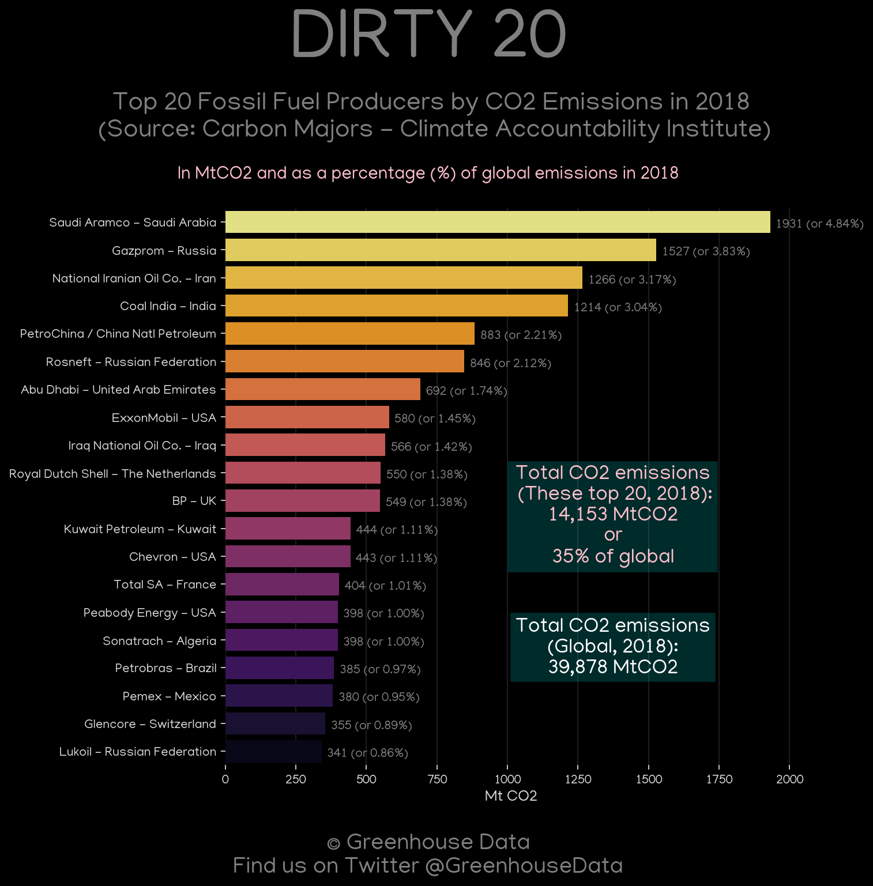
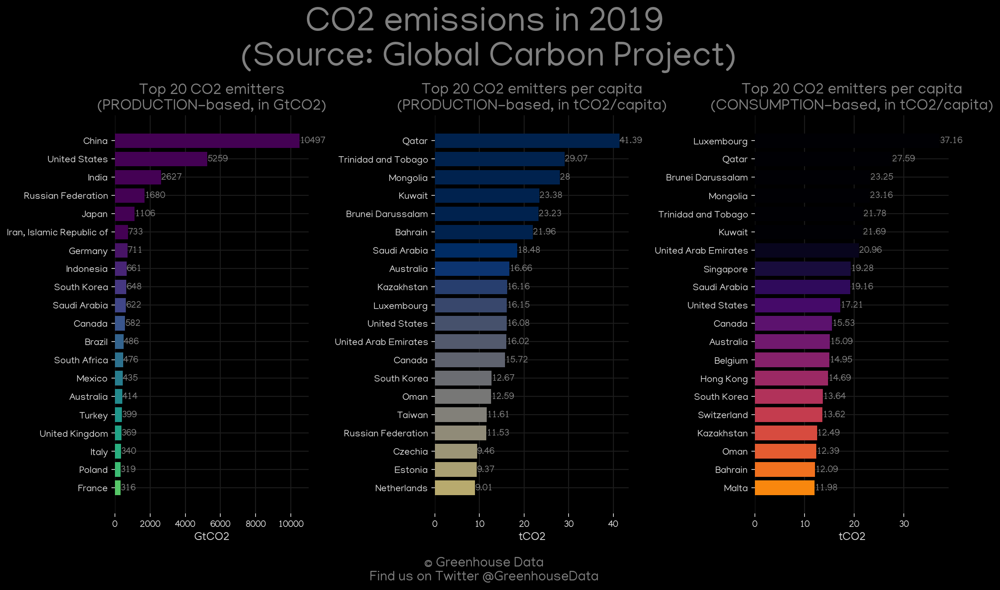
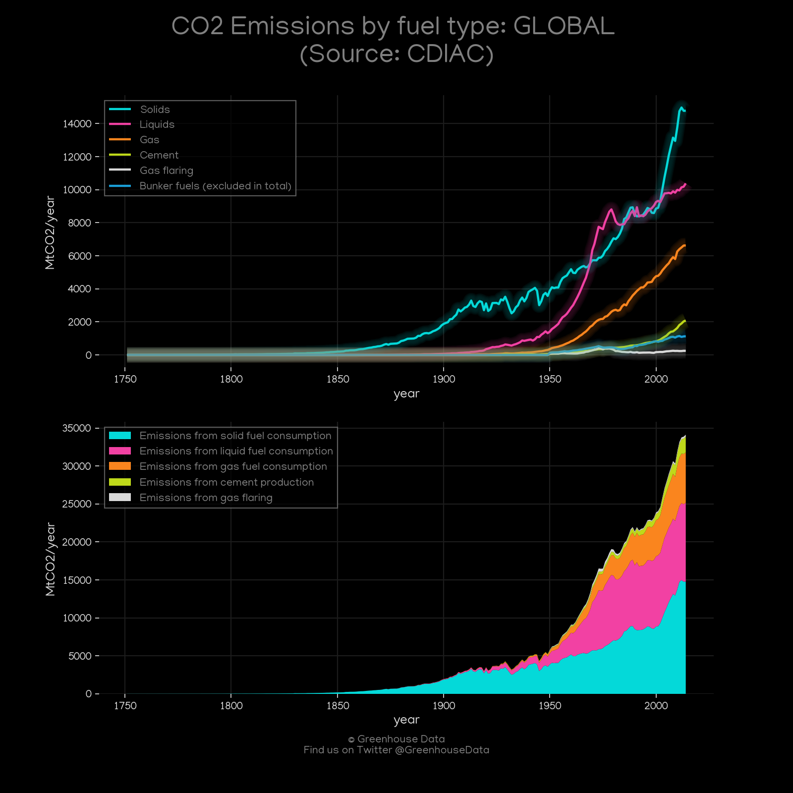

<h1>
Global Trends
</h1>
Here you will find a diverse set of global/international GHG emission figures.
 

<h3>
You can also find the complete inventory data (modified by Greenhouse Data) <a href="https://github.com/dquintani/GreenhouseData/tree/master/clean_data">here</a>

<h2>Figure 1</h2>

<h2>Figure 2</h2>

<h2>Figure 3</h2>

<h2>Figure 4</h2>

<h2>Figure 5</h2>

<h2>Figure 6</h2>

<h2>Figure 7</h2>

<h2>Figure 8</h2>

